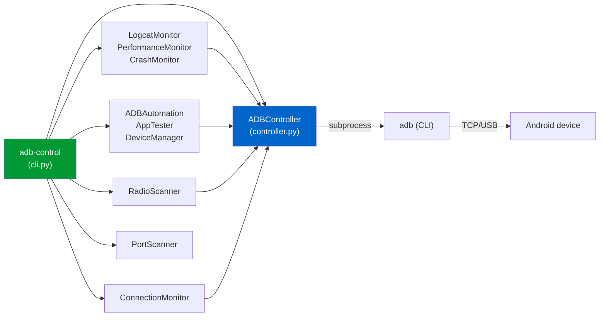
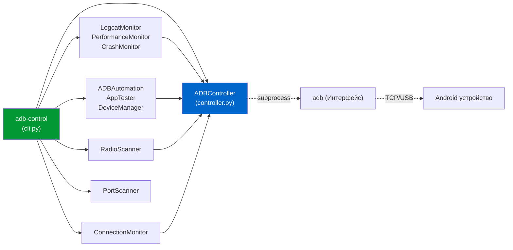

# adb-android-control

> *Comprehensive Android device control via ADB — for humans, agents, and CI.*

[](https://www.python.org/)
[](LICENSE)
[](docs/TESTING_DOCTRINE.md)
[](tests/)
[](tests/)
[](pyproject.toml)
[](.pre-commit-config.yaml)

[English](#english) · [Български](#български)

---

## English

### What it is
A typed Python package + CLI that wraps the standard `adb` binary with a clean, doctrine-tested API. Pairs with **Claude Code** as a marketplace skill, but works equally well as a plain Python library or shell tool. Version: `2.0.3`.

### 30-second pitch
```bash
pip install adb-android-control
adb-control devices
adb-control info -s EMULATOR-1
adb-control shot screen.png
adb-control monitor logcat
adb-control workflow ./my-test.json
```

Built around three principles:
1. **Behavioural test contracts.** Every public method has a typed test exercising the failure mode it claims to handle. 338 tests today, 1.59 : 1 test/code ratio.
2. **No hidden subprocess interleaving.** Every shell-out goes through `ADBController` (or one flagged streaming carve-out). No `shell=True` anywhere. Argv lists only.
3. **Observable contracts.** Typed exceptions, frozen value objects, wire-format-stable enum values. If we change a public name, your tests will tell you.

### Install

#### As a Python package
```bash
# From source (PyPI publish pending)
pip install -e ".[dev]"

# Or just the runtime dependencies
pip install -e .
```

#### As a Claude Code skill
```bash
git clone https://github.com/hah23255/adb-android-control.git \
    ~/.claude/skills/adb-android-control
claude /plugin marketplace add ~/.claude/skills/adb-android-control
```

### Quickstart

#### 1. Verify your `adb` is available
```bash
adb version
```
If this fails, install Android platform-tools or `pkg install android-tools` on Termux.

#### 2. Connect a device

##### USB
```bash
adb devices    # Authorize on the device when prompted
```

##### Wireless (Android 11+)
```bash
adb pair      <device-ip>:<pair-port>  <pair-code>
adb connect   <device-ip>:<connect-port>
```
See `docs/SETUP.md` for screenshots of the device-side flow.

#### 3. Use it

##### Python
```python
from adb_android_control import ADBController, DeviceOfflineError

ctrl = ADBController()                          # raises ADBNotFoundError if adb missing
print(ctrl.devices())                            # → list of dicts
info = ctrl.get_device_info()                    # → DeviceInfo
print(f"{info.model} on Android {info.android_version}")
ctrl.screenshot("/tmp/shot.png")
```

##### CLI
```bash
adb-control devices                  # list connected devices
adb-control info                     # JSON device snapshot
adb-control shot                     # screenshot.png in $CWD
adb-control monitor logcat -l W      # warning+ logcat stream
adb-control monitor crash            # crash detector
adb-control radio                    # WiFi + Bluetooth status
adb-control workflow ./test.json     # run an automation workflow
adb-control health                   # JSON health check
adb-control --version                # 2.0.3
```

#### 4. Author a workflow
```json
{
  "steps": [
    { "action": "wake",       "delay": 0.5 },
    { "action": "home",       "delay": 0.5 },
    { "action": "start_app",  "params": {"package": "com.example.app"}, "delay": 3 },
    { "action": "tap_center", "delay": 1 },
    { "action": "screenshot", "params": {"path": "after_tap.png"}, "delay": 0 }
  ]
}
```
```bash
adb-control workflow my-test.json
```
22 step kinds available — see `adb_android_control/automation.py`.

### Architecture Mapping

The full architecture deep-dive lives at `docs/ARCHITECTURE.md`, including sequence + state-machine diagrams.

### Why this exists
Most Android automation libraries are either:
- **Java/Kotlin** (e.g. libadb-android) — great for Android-app-internal usage, no help on the host.
- **uiautomator2 / Appium** — focused on UI test automation; heavyweight install; not great for raw ADB control.
- **Pure shell scripts** — fragile parsing; hard to test; brittle.

`adb-android-control` is the missing piece: **a typed, doctrine-tested Python wrapper** for everything `adb` can do, with sane error classification and zero hidden state.

### Testing — the Master Tester Doctrine
This project is governed by the **Master Tester Doctrine** (HH directive 2026-03-05). The 10 non-negotiable laws live at `docs/TESTING_DOCTRINE.md`. Highlights:

| Law | Mechanism in this repo |
|---|---|
| 1. Never modify a test to fix CI | pre-commit + CI test-file-integrity gate (Phase 7) |
| 6. Never mock subprocess directly | Poison-Pill `mock_adb` fixture in `tests/conftest.py` |
| 7. Ban `as any` in tests | `mypy --strict` with `disallow_any_explicit = true` |
| 8. Tests must be deterministic | `freezegun`, `_sleep`/`_now` indirection, no real timers |

#### Run the tests
```bash
pytest                       # 338 tests; ~10-20K Hypothesis examples
pytest -m unit               # unit only (default)
pytest -m property           # property-based fuzzing
pytest -m race               # threading + concurrency
pytest --cov                 # coverage report
```

### Fault Handling Manual
| Status / Error | Root Cause | Mitigation |
| :--- | :--- | :--- |
| `adb: command not found` | Android platform-tools or `adb` binary is missing from system `PATH`. | On Termux: `pkg install android-tools`. On Debian/Ubuntu: `sudo apt install adb`. On macOS: `brew install --cask android-platform-tools`. |
| Device shows as `offline` | ADB server-side state is stale, or the device's ADB daemon crashed. | Restart ADB: `adb kill-server && adb start-server`. If wireless, toggle Wireless Debugging on the device. |
| Device shows as `unauthorized` | The host key is not trusted by the device. | Authorize on the device screen. If no prompt, regenerate keys: `rm ~/.android/adbkey* && adb kill-server && adb start-server`. |
| Screenshot has 0 bytes | ADB `exec-out` adds `\r\n` line endings (older adb versions), or foldable display warnings are injected. | `screenshot()` strips foldable warnings automatically. Upgrade `adb` if `< 1.0.40`, or fall back to capturing on-device (`screencap -p /sdcard/shot.png`) and pulling. |
| Wireless ADB connection loops / high CPU | Connecting to localhost (`127.0.0.1`) under `proot` causes connection loops. | Never connect to loopback under `proot`. Use the phone's LAN IP (its `wlan0` address) for `adb connect`. |
| `ADBTimeoutError` | Subprocess hung or took longer than 30s limit. | Increase per-call timeout in `ctrl._run(..., timeout=120)` or restart ADB server. |

### Common Issues & Golden Rules
* **Golden Rule 1: Master Tester Doctrine Alignment.** Never mock `subprocess` directly. Always use the poison-pill `mock_adb` fixture to guarantee no leakage of real commands in CI/local runs.
* **Golden Rule 2: Explicit Subprocess Timeouts.** Never call `subprocess` without specifying a timeout to prevent hanging commands from blocking the runner indefinitely.
* **Golden Rule 3: No `shell=True`.** All shell command arguments must be lists (`argv`) to safeguard against command injection.
* **Golden Rule 4: Termux/proot LAN IP usage.** Under `proot` containers, always connect to the phone's LAN IP (`wlan0`) instead of `127.0.0.1` to prevent busy loops and high CPU usage.

---

## Български

### Какво представлява
Типизиран Python пакет + CLI, който обвива стандартния `adb` двоичен файл с изчистен, тестван съгласно доктрината API. Свързва се с **Claude Code** като пазарно умение (marketplace skill), но работи еднакво добре и като обикновена Python библиотека или конзолен инструмент. Версия: `2.0.3`.

### Представяне за 30 секунди
```bash
pip install adb-android-control
adb-control devices
adb-control info -s EMULATOR-1
adb-control shot screen.png
adb-control monitor logcat
adb-control workflow ./my-test.json
```

Изграден около три принципа:
1. **Поведенчески тестови договори.** Всеки публичен метод има тестов случай, който проверява режимите на грешка, с които той твърди, че се справя. 338 теста днес, 1.59 : 1 съотношение тест/код.
2. **Без скрито преплитане на подпроцеси.** Всяко извикване на шел преминава през `ADBController` (с изключение на едно отбелязано стрийминг изключение). Без `shell=True` никъде. Само списъци с аргументи (argv).
3. **Наблюдаеми договори.** Типизирани изключения, замразени обекти за стойност, стабилни по мрежов формат стойности на enums. При промяна на публично име, тестовете ще сигнализират.

### Инсталация

#### Като Python пакет
```bash
# От източник (предстои публикуване в PyPI)
pip install -e ".[dev]"

# Или само зависимостите за стартиране
pip install -e .
```

#### Като Claude Code умение
```bash
git clone https://github.com/hah23255/adb-android-control.git \
    ~/.claude/skills/adb-android-control
claude /plugin marketplace add ~/.claude/skills/adb-android-control
```

### Бърз старт

#### 1. Проверете дали `adb` е наличен
```bash
adb version
```
Ако командата се провали, инсталирайте Android platform-tools или `pkg install android-tools` в Termux.

#### 2. Свържете устройство

##### През USB
```bash
adb devices    # Оторизирайте на устройството при подкана
```

##### Безжично (Android 11+)
```bash
adb pair      <device-ip>:<pair-port>  <pair-code>
adb connect   <device-ip>:<connect-port>
```
Вижте `docs/SETUP.md` за екранни снимки на безжичния процес.

#### 3. Употреба

##### Python
```python
from adb_android_control import ADBController, DeviceOfflineError

ctrl = ADBController()                          # хвърля ADBNotFoundError ако adb липсва
print(ctrl.devices())                            # → списък от речници
info = ctrl.get_device_info()                    # → DeviceInfo
print(f"{info.model} на Android {info.android_version}")
ctrl.screenshot("/tmp/shot.png")
```

##### CLI
```bash
adb-control devices                  # списък със свързани устройства
adb-control info                     # JSON снимка на устройството
adb-control shot                     # screenshot.png в текущата папка
adb-control monitor logcat -l W      # logcat поток за предупреждения+
adb-control monitor crash            # детектор на сривове
adb-control radio                    # статус на WiFi + Bluetooth
adb-control workflow ./test.json     # изпълнение на автоматизационен процес
adb-control health                   # JSON здравен статус
adb-control --version                # 2.0.3
```

#### 4. Създаване на автоматизационен процес (workflow)
```json
{
  "steps": [
    { "action": "wake",       "delay": 0.5 },
    { "action": "home",       "delay": 0.5 },
    { "action": "start_app",  "params": {"package": "com.example.app"}, "delay": 3 },
    { "action": "tap_center", "delay": 1 },
    { "action": "screenshot", "params": {"path": "after_tap.png"}, "delay": 0 }
  ]
}
```
```bash
adb-control workflow my-test.json
```
Налични са 22 вида стъпки — вижте `adb_android_control/automation.py`.

### Архитектурно описание

Пълният архитектурен преглед е наличен в `docs/ARCHITECTURE.md`, включително диаграми на последователностите и крайните автомати.

### Защо съществува
Повечето библиотеки за автоматизация на Android са или:
- **Java/Kotlin** (напр. libadb-android) — отлични за вътрешно ползване в приложения, но безполезни на хост машината.
- **uiautomator2 / Appium** — фокусирани върху UI тестове; тежка инсталация; неподходящи за директен ADB контрол.
- **Чисти shell скриптове** — крехко парсване на текст; трудни за тестване.

`adb-android-control` е липсващото звено: **типизирана, тествана съгласно доктрината Python обвивка** за всичко, което `adb` може, със смислено класифициране на грешките и без скрито състояние.

### Тестване — Доктрината на главния тестер
Този проект се управлява от **Доктрината на главния тестер** (директива HH 2026-03-05). Десетте пределно ясни правила са описани в `docs/TESTING_DOCTRINE.md`. Основни акценти:

| Правило | Механизъм в това хранилище |
|---|---|
| 1. Никога не променяйте тест за фиксиране на CI | pre-commit + CI защита на интегритета на тестовете |
| 6. Никога не симулирайте подпроцеси директно | Фикстура с отровно хапче `mock_adb` в `tests/conftest.py` |
| 7. Забрана на `as any` в тестовете | `mypy --strict` с изрична забрана за `any` |
| 8. Тестовете трябва да са детерминистични | `freezegun`, индирекция на времето, без реални таймери |

#### Стартиране на тестовете
```bash
pytest                       # 338 теста; ~10-20 хиляди Hypothesis примера
pytest -m unit               # само единични тестове (по подразбиране)
pytest -m property           # property-базиран фъзинг
pytest -m race               # конкурентност и нишки
pytest --cov                 # репорт за покритие
```

### Ръководство за отстраняване на неизправности
| Статус / Грешка | Причина | Решение |
| :--- | :--- | :--- |
| `adb: command not found` | Пакетът `adb` липсва в системния път (`PATH`). | Под Termux: `pkg install android-tools`. Под Debian/Ubuntu: `sudo apt install adb`. Под macOS: `brew install --cask android-platform-tools`. |
| Устройството е `offline` | Застаряло състояние на ADB сървъра или срив на ADB даемона на устройството. | Рестартирайте сървъра: `adb kill-server && adb start-server`. За безжична връзка: изключете и включете Wireless Debugging. |
| Устройството е `unauthorized` | Ключът на хоста не е в списъка с доверени на устройството. | Потвърдете разрешението на екрана на устройството. При липса на промпт: `rm ~/.android/adbkey* && adb kill-server && adb start-server`. |
| Скрийншот с размер 0 байта | Символи за край на ред `\r\n` при по-стари версии на adb, или съобщения за сгъваем дисплей. | `screenshot()` автоматично филтрира излишните байтове. Обновете `adb` до версия `>= 1.0.40` или правете скрийншот локално в устройството и го изтегляйте (`adb pull`). |
| Безкраен цикъл при Wireless ADB под proot | Опит за свързване към localhost (`127.0.0.1`) в proot среда. | Свързвайте се към LAN IP адреса на телефона (адреса на `wlan0`), а не към `127.0.0.1`, за да избегнете натоварване на процесора. |
| `ADBTimeoutError` | Процесът увисва или трае по-дълго от лимита от 30 секунди. | Увеличете времето за изчакване чрез `ctrl._run(..., timeout=120)` или рестартирайте ADB сървъра. |

### Чести проблеми и Златни правила
* **Златно правило 1: Доктрината на главния тестер.** Никога не симулирайте (mock) `subprocess` директно. Винаги използвайте фикстурата `mock_adb`, за да гарантирате, че реални ADB команди не изтичат по време на тестове.
* **Златно правило 2: Изрични лимити за време.** Никога не извиквайте процеси без изрично време за изчакване (timeout), за да не се допуска увиснали процеси да блокират изпълнението.
* **Златно правило 3: Без `shell=True`.** Всички параметри на команди трябва да се предават като списъци (`argv`), за да се избегнат уязвимости от инжектиране на команди.
* **Златно правило 4: Използване на LAN IP под Termux/proot.** В `proot` среди винаги се свързвайте към LAN IP адреса на устройството (`wlan0`) вместо към `127.0.0.1`, за да предотвратите безкрайни цикли и високо натоварване на процесора.
