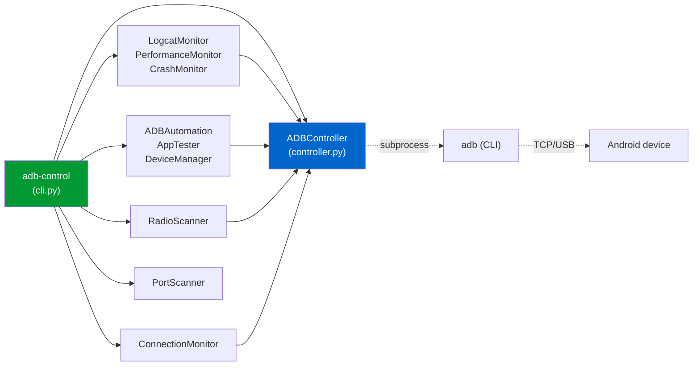

# adb-android-control

> *Comprehensive Android device control via ADB — for humans, agents, and CI.*

[](https://www.python.org/)
[](LICENSE)
[](docs/TESTING_DOCTRINE.md)
[](tests/)
[](tests/)
[](pyproject.toml)
[](.pre-commit-config.yaml)

A typed Python package + CLI that wraps the standard `adb` binary with
a clean, doctrine-tested API. Pairs with **Claude Code** as a
marketplace skill, but works equally well as a plain Python library or
shell tool.

---

## 30-second pitch

```bash
pip install adb-android-control
adb-control devices
adb-control info -s EMULATOR-1
adb-control shot screen.png
adb-control monitor logcat
adb-control workflow ./my-test.json
```

Built around three principles:

1. **Behavioural test contracts.** Every public method has a typed test
   exercising the failure mode it claims to handle. 338 tests today,
   1.59 : 1 test/code ratio.
2. **No hidden subprocess interleaving.** Every shell-out goes through
   `ADBController` (or one flagged streaming carve-out). No `shell=True`
   anywhere. Argv lists only.
3. **Observable contracts.** Typed exceptions, frozen value objects,
   wire-format-stable enum values. If we change a public name, your
   tests will tell you.

## Install

### As a Python package

```bash
# From source (PyPI publish pending)
pip install -e ".[dev]"

# Or just the runtime dependencies
pip install -e .
```

### As a Claude Code skill

```bash
git clone https://github.com/hah23255/adb-android-control.git \
    ~/.claude/skills/adb-android-control
claude /plugin marketplace add ~/.claude/skills/adb-android-control
```

## Quickstart

### 1. Verify your `adb` is available

```bash
adb version
```

If this fails, install Android platform-tools or `pkg install
android-tools` on Termux.

### 2. Connect a device

#### USB
```bash
adb devices    # Authorize on the device when prompted
```

#### Wireless (Android 11+)
```bash
adb pair      <device-ip>:<pair-port>  <pair-code>
adb connect   <device-ip>:<connect-port>
```

See [`docs/SETUP.md`](docs/SETUP.md) for screenshots of the device-side
flow.

### 3. Use it

#### Python

```python
from adb_android_control import ADBController, DeviceOfflineError

ctrl = ADBController()                          # raises ADBNotFoundError if adb missing
print(ctrl.devices())                            # → list of dicts
info = ctrl.get_device_info()                    # → DeviceInfo
print(f"{info.model} on Android {info.android_version}")
ctrl.screenshot("/tmp/shot.png")
```

#### CLI

```bash
adb-control devices                  # list connected devices
adb-control info                     # JSON device snapshot
adb-control shot                     # screenshot.png in $CWD
adb-control monitor logcat -l W      # warning+ logcat stream
adb-control monitor crash            # crash detector
adb-control radio                    # WiFi + Bluetooth status
adb-control workflow ./test.json     # run an automation workflow
adb-control health                   # JSON health check
adb-control --version                # 2.0.0
```

### 4. Author a workflow

```json
{
  "steps": [
    { "action": "wake",       "delay": 0.5 },
    { "action": "home",       "delay": 0.5 },
    { "action": "start_app",  "params": {"package": "com.example.app"}, "delay": 3 },
    { "action": "tap_center", "delay": 1 },
    { "action": "screenshot", "params": {"path": "after_tap.png"}, "delay": 0 }
  ]
}
```

```bash
adb-control workflow my-test.json
```

22 step kinds available — see
[`adb_android_control/automation.py`](adb_android_control/automation.py).

## Architecture



The full architecture deep-dive lives at
[`docs/ARCHITECTURE.md`](docs/ARCHITECTURE.md), including
sequence + state-machine diagrams.

## Why this exists

Most Android automation libraries are either:

- **Java/Kotlin** (e.g. [libadb-android](https://github.com/MuntashirAkon/libadb-android)) — great for Android-app-internal usage, no help on the host.
- **uiautomator2 / Appium** — focused on UI test automation; heavyweight install; not great for raw ADB control.
- **Pure shell scripts** — fragile parsing; hard to test; brittle.

`adb-android-control` is the missing piece: **a typed, doctrine-tested
Python wrapper** for everything `adb` can do, with sane error
classification and zero hidden state.

## Testing — the Master Tester Doctrine

This project is governed by the **Master Tester Doctrine** (HH directive
2026-03-05). The 10 non-negotiable laws live at
[`docs/TESTING_DOCTRINE.md`](docs/TESTING_DOCTRINE.md). Highlights:

| Law | Mechanism in this repo |
|---|---|
| 1. Never modify a test to fix CI | pre-commit + CI test-file-integrity gate (Phase 7) |
| 6. Never mock subprocess directly | Poison-Pill `mock_adb` fixture in `tests/conftest.py` |
| 7. Ban `as any` in tests | `mypy --strict` with `disallow_any_explicit = true` |
| 8. Tests must be deterministic | `freezegun`, `_sleep`/`_now` indirection, no real timers |

### Run the tests

```bash
pytest                       # 338 tests; ~10-20K Hypothesis examples
pytest -m unit               # unit only (default)
pytest -m property           # property-based fuzzing
pytest -m race               # threading + concurrency
pytest --cov                 # coverage report
```

## Project status

| Phase | Status |
|---|---|
| 0. Security purge | ✅ v1.0.1 shipped |
| 1. Test foundation + 8 modules | ✅ `phase-1b-complete` |
| 2. Code quality + CLI | ✅ `phase-2-complete` |
| 3. Hypothesis + race + failure injection | ✅ `phase-3-complete` |
| 4. Documentation | ✅ shipped with v2.0 GA |
| 5. Discoverability | ✅ shipped with v2.0 GA |
| 6. Visual polish (logo + GIFs) | 🟡 in progress |
| 7. CI matrix + Codecov + CodeQL | ✅ shipped with v2.0 GA |
| 8. v2.0 GA | ✅ **2026-05-05** 🚀 |

**Public GA shipped 2026-05-05** (v2.0.0 — see [CHANGELOG](CHANGELOG.md)).
Roadmap and per-release deliverables are tracked in `CHANGELOG.md`.

## Documentation

| Doc | Audience |
|---|---|
| [`docs/ARCHITECTURE.md`](docs/ARCHITECTURE.md) | New contributors |
| [`docs/TESTING_DOCTRINE.md`](docs/TESTING_DOCTRINE.md) | Anyone writing tests |
| [`SECURITY.md`](SECURITY.md) | Vulnerability reporters |
| [`docs/MIGRATING.md`](docs/MIGRATING.md) | Users on v1.0.x |
| [`docs/SETUP.md`](docs/SETUP.md) | First-time setup |
| [`docs/TROUBLESHOOTING.md`](docs/TROUBLESHOOTING.md) | When things go wrong (decision tree) |
| [`docs/USE_CASES.md`](docs/USE_CASES.md) | Recipe gallery |
| [`docs/TUTORIALS.md`](docs/TUTORIALS.md) | Step-by-step walkthroughs |
| [`CHANGELOG.md`](CHANGELOG.md) | Release history |
| [`CONTRIBUTING.md`](CONTRIBUTING.md) | Contributors |

## Contributing

PRs welcome — see [`CONTRIBUTING.md`](CONTRIBUTING.md) for the
doctrine-aligned workflow.

## License

MIT — see [`LICENSE`](LICENSE).
