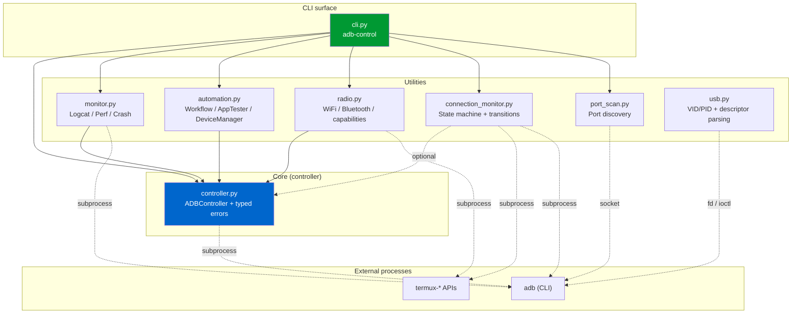
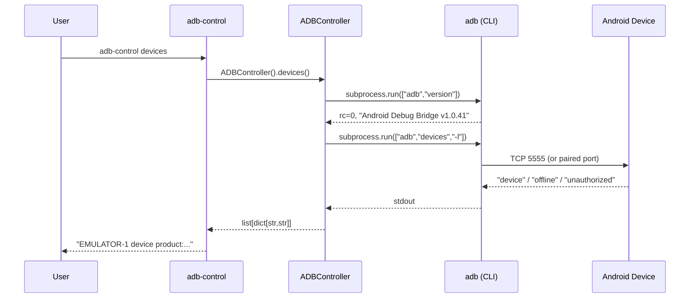
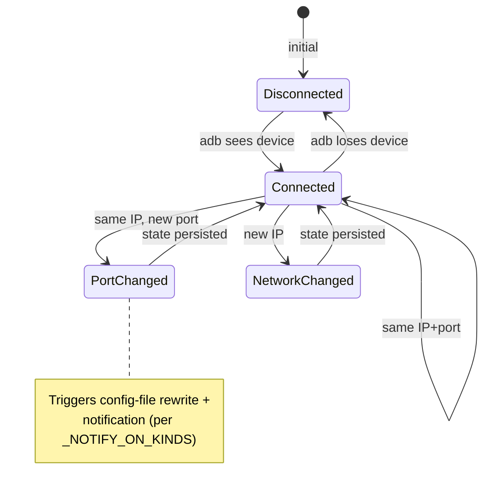

# Architecture

> *How `adb-android-control` is organised, what each module owns, and why.*

## High-level

`adb-android-control` is a **thin, typed Python wrapper over the `adb`
CLI** plus a small constellation of utilities for monitoring,
automation, radio scanning, port discovery, and USB identification.

It does NOT speak the ADB wire protocol directly (unlike, e.g.,
[libadb-android](https://github.com/MuntashirAkon/libadb-android) for
Java). Every operation shells out to a real `adb` binary and parses
its stdout. This is a deliberate trade-off:

| Choice | Win | Cost |
|---|---|---|
| Shell out to `adb` | Tracks Android-tools releases for free; no protocol drift | Subprocess overhead per call (~10ms on Linux); requires `adb` on PATH |
| Parse stdout | Simple, debuggable | Output format changes across `adb` versions |

## Module responsibilities



### `controller.py` — the foundation
- `ADBController` is the canonical wrapper around the `adb` CLI.
- Owns the **typed exception hierarchy** (`ADBError` →
  `ADBNotFoundError` / `DeviceOfflineError` / `ADBTimeoutError` /
  `ADBPermissionError`).
- Verifies `adb` availability eagerly in `__init__` (fails fast).
- Exposes `shell(cmd: str)` as the public composition point — every
  other utility module routes through this rather than reaching into
  the private `_shell`.

### `monitor.py` — long-lived observers
- `LogcatMonitor`, `PerformanceMonitor`, `EventMonitor`, `CrashMonitor`.
- Streaming primitives (`subprocess.Popen` for logcat / getevent) are
  the **one carve-out** from "go through `ADBController`" — they need
  long-lived stdout pipes that don't fit the capture-and-return shape.
- `parse_log_line` and `is_crash_entry` are `@staticmethod` pure
  predicates — testable without spinning up subprocesses or threads.

### `automation.py` — orchestration
- `ADBAutomation` dispatches `AutomationStep` objects via a
  `dict[str, Callable]` handler table (was a giant `if/elif` in v1.0).
- `AppTester` (extends `ADBAutomation`) for install / launch / smoke /
  stress.
- `DeviceManager` (extends `ADBAutomation`) for health check /
  cleanup / batch ops / APK extraction.
- `ScreenRecorder` is independent (different lifecycle).
- `_sleep` and `_now` are module-level aliases over `time.sleep` /
  `time.monotonic` so tests can substitute deterministic fakes.

### `radio.py` — Wi-Fi + Bluetooth probes
- Pure helpers (`freq_to_channel`, `freq_to_band`, `rssi_to_quality`)
  exported at module level for direct unit + property testing.
- Pure parsers (`parse_wifi_info`, `parse_scan_results`,
  `parse_bluetooth_info`, `parse_bluetooth_devices`, `parse_link_stats`)
  separate I/O from logic.
- `RadioScanner` class is the I/O surface; everything else is data
  transformation.

### `connection_monitor.py` — state machine
- `detect_changes(last, current) -> list[Change]` is **pure** and
  testable in isolation (Doctrine Law 9).
- `ChangeType` enum: `CONNECTED`, `DISCONNECTED`, `PORT_CHANGED`,
  `NETWORK_CHANGED`, `WIFI_CHANGED`, `SIGNAL_CHANGED`. Enum value
  strings are wire format and part of the public API.
- Full DI for paths, notifier, probes, clock — every I/O dependency
  swappable for tests.

### `port_scan.py` — concurrent TCP probe
- Thread-pool fan-out (`concurrent.futures.ThreadPoolExecutor`)
  controlled by `max_workers` parameter.
- `check_port` and `try_adb_connect` are module-level and DI'd.
- `rewrite_devices_config` is **pure** — string in, string out — and
  property-tested for idempotency and line-count preservation.

### `usb.py` — VID/PID identification
- `parse_device_descriptor(bytes) -> USBDeviceInfo | None` is the
  canonical pure function and the package's heaviest Hypothesis
  fuzzing target.
- `USB_VENDORS` and `USB_KNOWN_DEVICES` are module-level constants;
  their schema is part of the public API (Doctrine Law 2).
- Two I/O paths: `identify_via_fd` (Termux `termux-usb -e` callback)
  and `identify_via_ioctl` (Linux USBDEVFS).

### `cli.py` — the only I/O entrypoint
- `adb-control` console-script (wired via `pyproject.toml`).
- 9 subcommands routing to the modules above.
- Typed exit codes:
  - `0` success
  - `1` "no devices" / "nothing found"
  - `2` workflow failure
  - `3` `ADBError` raised
  - `130` `KeyboardInterrupt` (128 + SIGINT)

## Layering rules

1. **Package modules never call each other's private methods.** If
   module B needs functionality from module A, A exposes it as a
   public method or function. Currently enforced by code review;
   Phase 7 will add `import-linter` to gate this in CI.
2. **`cli.py` is allowed to know about every module**; nothing else
   imports `cli`.
3. **`controller.py` is the only module that constructs `subprocess.run`
   for ADB**; other modules either compose against `ADBController.shell()`
   or, for streaming, build their own `subprocess.Popen` with a flagged
   carve-out (currently: `monitor.py` and `connection_monitor.py`).
4. **No production code imports from `tests/`.** Enforced by
   `dependency-cruiser`-style rules (Phase 7).

## Connection sequence (wireless ADB)



## State machine — connection_monitor



## Testing architecture

```
tests/
├── conftest.py              # Poison-Pill PoisonPillADB fixture +
│                            # frozen_clock + FakeDevice factory
├── unit/                    # Mock-everything tests (default)
│   ├── test_harness_smoke.py        # the harness itself
│   ├── test_controller.py
│   ├── test_monitor.py
│   ├── test_automation.py
│   ├── test_radio.py
│   ├── test_connection_monitor.py
│   ├── test_port_scan.py
│   ├── test_usb.py
│   ├── test_cli.py
│   └── test_failure_injection.py    # exit-code coverage
├── property/                # Hypothesis property-based tests
│   └── test_parsers.py
├── race/                    # threading + time-determinism
│   └── test_concurrent.py
├── integration/             # gated to nightly (real adb) — Phase 7
└── quarantine/              # known-flaky, opened-issue tracked
```

### Test markers (`pyproject.toml`)

| Marker | Default? | Purpose |
|---|---|---|
| `unit` | Run | pure-Python; no subprocess / network / device |
| `integration` | Skip | requires real `adb` binary |
| `device` | Skip | requires real connected Android device |
| `property` | Run | Hypothesis property-based tests |
| `race` | Run | threading + concurrency primitives |
| `slow` | Run | tests > 1s; exclude with `-m "not slow"` |
| `quarantine` | Skip | known-flaky; **never tolerated outside `quarantine/`** |

## Doctrine alignment

All test work is governed by the **Master Tester Doctrine** at
[`docs/TESTING_DOCTRINE.md`](./TESTING_DOCTRINE.md). Architectural
implications:

| Doctrine Law | Architectural enforcement |
|---|---|
| 2 — behaviour not implementation | `_*` methods are package-private; tests target public API |
| 5 — isolated tests | Frozen value objects throughout; `tmp_path` per fs test |
| 6 — never mock fetch/subprocess directly | Poison-Pill `mock_adb` fixture in `conftest.py` |
| 7 — ban `as any` / `# type: ignore` | `mypy --strict` + `disallow_any_explicit = true` |
| 8 — deterministic | `_sleep`/`_now` indirection; `freezegun`; injected `now_fn` |
| 9 — one concept per test | Pure parsers extracted as module-level functions |

## Deprecation track

`scripts/*.py` are **deprecation shims** that re-export the package's
public API and emit `DeprecationWarning` on import. They will be
removed in v2.0. Any new code must import from
`adb_android_control.<module>` directly.
