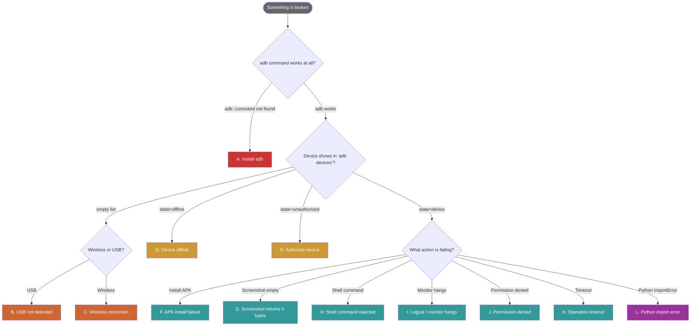

# Troubleshooting — Decision Tree

> *When things go wrong, start at the top of the decision tree. Each
> terminal node links to a section below with a specific fix.*



---

## A. `adb: command not found`

**Symptoms**

```
$ adb version
bash: adb: command not found
$ adb-control devices
adb-control: error: ADB binary not found on PATH.
```

**Diagnosis path**

1. Confirm: `which adb` returns empty
2. Confirm: package installer is available

**Fix**

| Platform | Command |
|---|---|
| Termux on Android | `pkg install android-tools` |
| Debian/Ubuntu | `sudo apt install adb` |
| macOS (Homebrew) | `brew install --cask android-platform-tools` |
| Windows | Install [platform-tools](https://developer.android.com/tools/releases/platform-tools), add to PATH |

**Verify**

```bash
adb version
# → Android Debug Bridge version 1.0.x ...
```

---

## B. USB-attached device not detected

**Symptoms**

```
$ adb devices
List of devices attached
                              ← empty
```

**Diagnosis path**

1. Cable check — try a *known-good* USB-data cable. Many cables are
   power-only; this is the #1 false negative.
2. Port check — try a different USB port, ideally USB-2.0 (some
   USB-3.0 controllers have ADB issues).
3. `lsusb` (Linux) / `ioreg` (macOS) shows the device's USB descriptor?
4. Developer Options enabled on the device?
5. USB debugging enabled in Developer Options?
6. Default USB mode is "File transfer" (MTP) or "ADB"?

**Fix**

| Branch | Action |
|---|---|
| Wrong cable | Swap to data-capable USB cable |
| Wrong port | Use direct host port (not hub) |
| Dev Options off | On device: Settings → About phone → tap Build Number 7× |
| USB debugging off | Dev Options → USB debugging → ON |
| Wrong USB mode | Pull notification → Tap "USB charging" → "File transfer" or "ADB" |

**Verify**

```bash
adb kill-server && adb start-server
adb devices
# → <serial>    device
```

---

## C. Wireless ADB reconnect

**Symptoms**

```
$ adb devices
List of devices attached
<ip>:<port>    offline    ← or empty list

# Device IP changed (DHCP), or wireless port rotated
```

**Diagnosis path**

1. Did the device reboot? → port has rotated
2. Did you switch networks? → IP has changed
3. Is Wireless Debugging still enabled in Dev Options?

**Fix using `adb-control`**

```bash
adb-control scan-port <device-ip> --start 30000 --end 45000
# → ADB found at <device-ip>:42891

adb connect <device-ip>:42891
adb-control devices
```

**Fix manually**

```bash
adb disconnect
# Re-pair (Android 11+):
adb pair <ip>:<pair-port> <pair-code>
adb connect <ip>:<connect-port>
```

To find the new pairing/connection ports:
- On device: Dev Options → Wireless debugging → tap "Pair device with
  pairing code" (gives a new pair port + code) or read the connection
  port from the same screen.

**On Termux / proot (running on the phone itself)**

- Connect to the phone's **LAN IP** (its `wlan0` address), **not** `127.0.0.1`. Inside a
  proot container the network namespace returns `ENOSYS` on a loopback `adb connect`
  (`failed to connect ... Function not implemented`), so the loopback bridge never comes
  up even though the port is open.
- A loopback `adb connect` to a dead target can then loop forever: the adb server retries
  the (unreachable) target every ~3 s, burning ~80 % of a CPU core indefinitely. Clear it
  with `adb disconnect <target>`; if the server is wedged and ignores the disconnect, kill
  the `adb -L tcp:5037 fork-server` PID — it respawns clean without the stale target.

---

## D. Device shows as `offline`

**Symptoms**

```
$ adb devices
<ip>:<port>    offline
```

**Diagnosis**

Either: ADB-server-side state is stale, OR the device's ADB daemon
crashed.

**Fix**

```bash
# Tier 1 (server-side): restart adb
adb kill-server
adb start-server
adb devices

# Tier 2 (device-side): toggle Wireless Debugging
# On device: Dev Options → Wireless debugging → OFF, wait 3s, → ON
```

---

## E. Device shows as `unauthorized`

**Symptoms**

```
$ adb devices
<serial>    unauthorized
```

**Diagnosis**

Your host's ADB key is not in the device's trust list. Look at the
device — there should be a permission dialog.

**Fix**

1. On the device: tap "Always allow from this computer" → OK
2. If no dialog appears:
   ```bash
   adb kill-server
   rm ~/.android/adbkey ~/.android/adbkey.pub   # generates fresh keys
   adb start-server
   adb devices    # dialog should now appear
   ```

---

## F. APK install failure

**Symptoms**

```python
ctrl.install_apk("/tmp/app.apk")  # → False
```

```
adb: failed to install: INSTALL_FAILED_*
```

**Diagnosis matrix**

| Error string | Cause | Fix |
|---|---|---|
| `INSUFFICIENT_STORAGE` | Out of space | `adb shell df -h /data` to confirm; clean cache |
| `VERSION_DOWNGRADE` | Older version than installed | `install_apk(apk, replace=True, ...)` not enough; pass `--downgrade` flag (PR welcome) or uninstall first |
| `UPDATE_INCOMPATIBLE` | Different signing cert | Uninstall existing first |
| `MISSING_SHARED_LIBRARY` | APK uses native lib not on device | Wrong APK ABI; use universal or matching ABI |
| `NO_MATCHING_ABIS` | APK is `arm64-v8a` only on a `armeabi-v7a` device | Get a multi-ABI APK |
| `TEST_ONLY` | APK has `android:testOnly="true"` | Build a release APK or pass `-t` (PR welcome) |

**Quick diagnostic**

```bash
adb-control shell "pm install /sdcard/app.apk"
# Read the full error from stdout/stderr
```

---

## G. Screenshot returns 0 bytes / empty PNG

**Symptoms**

```python
ctrl.screenshot("shot.png")  # returns True
# But shot.png is 0 bytes or unviewable
```

**Diagnosis**

Two known causes:

1. `exec-out` adds `\r\n` line endings on some devices, corrupting the PNG stream.
   `adb_android_control` uses `exec-out` (no shell-wrap), the correct path; adb
   versions < 1.0.40 may still corrupt.
2. **Multi-display devices (foldables such as the Z Fold7)** — `screencap` prints
   `[Warning] Multiple displays were found...` to **stdout, ahead of the PNG**. Raw
   `adb exec-out screencap -p > shot.png` therefore produces a file whose first ~350
   bytes are warning text and which no viewer will open. Note `screencap -d 0` does not
   help — foldables reject display id `0`.

Confirm which one by inspecting the first bytes — a valid PNG starts with `89 50 4E 47`:

```bash
head -c 16 shot.png | xxd        # expect: 8950 4e47 0d0a 1a0a ...
```

**Fix**

`screenshot()` (v2.0.0+) locates the PNG signature and strips any preceding bytes, so the
toolkit handles the multi-display banner automatically. If you are calling `adb` directly:

```bash
# Verify adb version (upgrade if < 1.0.40)
adb version

# Safe path that avoids the stdout banner entirely: capture on-device, then pull
adb shell screencap -p /sdcard/shot.png
adb pull /sdcard/shot.png ./shot.png
adb shell rm /sdcard/shot.png
```

---

## H. Shell command rejected / behaves weirdly

**Symptoms**

```python
ctrl.shell("input text 'Hello world!'")
# Types "Hello%world!" — special chars mangled
```

**Diagnosis**

ADB's `input text` has well-documented escaping quirks:
- Spaces become `%s`
- Single quotes need `\'`
- Special chars are unreliable

**Fix**

For unicode/special-char input, use the `keyevent` route or a
software keyboard like `ADBKeyboard`:

```bash
# Set ADBKeyboard as the input method
adb shell ime set com.android.adbkeyboard/.AdbIME

# Send text via broadcast (handles unicode cleanly)
adb shell am broadcast -a ADB_INPUT_TEXT --es msg 'Hello world! 🚀'

# Restore default IME
adb shell ime reset
```

---

## I. Logcat / monitor hangs

**Symptoms**

```python
mon = LogcatMonitor()
mon.start()
# ...nothing comes through, or process never exits
```

**Diagnosis**

Three common causes:

1. **Filter too aggressive** — your `filter_level="F"` only emits
   FATAL; nothing is happening.
2. **Buffer full** — `adb logcat -d` (dump) returns; `adb logcat`
   without `-d` streams forever (correct for `LogcatMonitor`).
3. **Subprocess not cleanly stopped** — `mon.stop()` not called.

**Fix**

```python
mon = LogcatMonitor()
try:
    mon.start(filter_level="V")  # or "I" for info+
    ...
finally:
    mon.stop()  # ALWAYS in a finally
```

The `LogcatMonitor.stop()` method is idempotent and tested in
`tests/race/test_concurrent.py`.

---

## J. Permission denied (`ADBPermissionError`)

**Symptoms**

```python
ctrl.shell("cat /data/data/com.example/databases/main.db")
# raises ADBPermissionError
```

**Diagnosis**

You're trying to access app-private storage without root or
debuggable-app access.

**Fix matrix**

| Path you want | Requires | How |
|---|---|---|
| `/data/data/<pkg>/...` of YOUR debuggable app | Debuggable build | `adb shell run-as <pkg> cat ...` |
| `/data/data/<pkg>/...` of any app | Root | `adb root` (only works on userdebug/eng builds) |
| `/sdcard/Download/...` | Nothing | works directly |
| `/system/...` (write) | Root | Most production devices: not possible |

---

## K. Operation timeout (`ADBTimeoutError`)

**Symptoms**

```
ADBTimeoutError: Command timed out after 30s: shell dumpsys ...
```

**Diagnosis**

Either the command actually takes longer than 30 s on this device,
or `adb-server` is wedged.

**Fix**

```python
# Increase per-call timeout
ctrl._run(["shell", "dumpsys"], timeout=120)  # 2 min

# Or restart adb if recurring
import subprocess
subprocess.run(["adb", "kill-server"])
subprocess.run(["adb", "start-server"])
```

For monitor loops, the streaming subprocess has no per-line timeout
— if it hangs, call `monitor.stop()`.

---

## L. Python import error

**Symptoms**

```
ImportError: cannot import name 'ADBController' from 'adb_android_control'
```

or:

```
DeprecationWarning: scripts.adb_controller is deprecated; import from
adb_android_control instead. This shim will be removed in v2.0.
```

**Diagnosis**

Either you're on v1.0.x and using the old import path (which is fine
until v2.0), or you have a partial install.

**Fix**

```bash
# Reinstall in editable mode
pip install -e ".[dev]"

# Verify
python -c "from adb_android_control import ADBController; print(ADBController.__module__)"
# → adb_android_control.controller
```

If you see the deprecation warning, migrate per
[`docs/MIGRATING.md`](MIGRATING.md).

---

## When the decision tree doesn't help

- **Search [closed issues](https://github.com/hah23255/adb-android-control/issues?q=is%3Aissue+is%3Aclosed)** first.
- **Open a new issue** with: `adb version` output, OS, full error
  message, and the smallest reproducer that triggers it.
- For security-relevant issues, follow [`SECURITY.md`](../SECURITY.md)
  — do NOT file public issues for vulnerabilities.

## Diagnostic data-dump for bug reports

Run this and paste the output (it does NOT include any PII —
`device_id`, BSSID, or IP — just version/state info):

```bash
adb-control --version
adb version
adb devices -l
python -c "import adb_android_control as p; print(p.__version__)"
python -c "import sys; print(sys.version)"
uname -a
```
